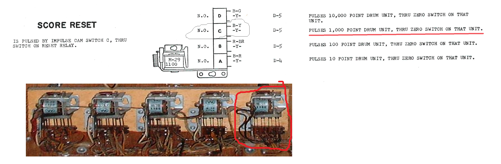
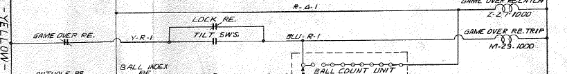
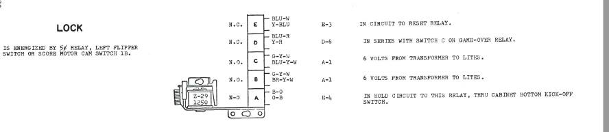
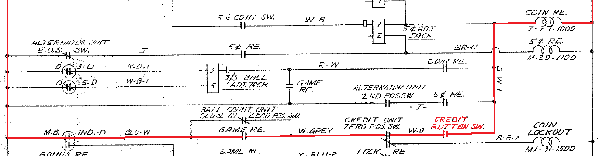

# Space Lab Pinball (Williams)

## Links:

- [EM Repair](https://www.pinrepair.com/em/)
- [Pinside](https://pinside.com/pinball/machine/spacelab)
- [YouTube](https://www.youtube.com/watch?v=ZWouGSnXjZg)
- [Score Wheel](https://homepinballrepair.com/em-score-reels/#:~:text=Introduction,sensor%20switch%20is%20not%20working.)
- [IPDB Sky Lab](https://www.ipdb.org/machine.cgi?id=2202)
- [IPDB Space Lab](https://www.ipdb.org/machine.cgi?id=6620)

## Annotated Files

* [Schematic](Williams_1974_Skylab_Schematic_submitted_by_Steve_Corley_Annotated.pdf)
* [Inside Cabinet](InsideCabinetAnnotated.png)
* [Back Cabinet](BackCabinetAnnotated.png)

## Possible Fix

### Score not Resetting

The 1000 score is not resetting when the reset button is pressed. The number doesn't move.  If I manually reset the scoring drum to zero, then the machine work ok.

 1. Score Reset Relay for 1000 Point Cam contact cleaning.

    

### Tilt switches are too sensitive

1. Coin slap
2. Plumb Bob
3. Lift Ball
4. Kick
5. Under the playing area

[Williams Skylab when turned on says TILT after previously playing fine](https://pinside.com/pinball/forum/topic/williams-skylab-when-turned-on-says-tilt-after-previously-playing-fine)

## 16 -Jan-2026

* The 100 Point Drum is not resetting, and the score motor continues to run.
  * Fixed
    * Adjusted the Score Reset Relay Contacts.
    * Re-soldered a loose wire on the top, switched on the 100 Point Drum.
* Tilt Issue
  * Checked all of the Tilt switches.
    * Fixed
      * Not a consistent issue.
      * Found one that has insulation off and might be shorting with the other switch wire.
      * Found a Tilt Relay next to the score motor.  The front Slam and Kick sets this relay, and cannot be reset.
* Ball Count
  * The ball count adjustment is set to 5 balls.  The machine only shows 2 balls, but plays 3 balls.  Possible light bulb is burned out.
* 1000 Point Drum during reset?
  * When resetting with the credit button, or Reset Relay, maybe even when turning on.
    * This needs to be monitored.
    * It fixed itself after some time working on other issues.
    * During the reset, the first latched relay goes off and on, and the knocker is energized.
* Pressing the "S" and "K" causes the 10's drum to keep going and the Score Motor keep running.  Also, related to the 10's Drum is working if the rest of the "SKYLAB" is pressed, then the Advance Unit also runs, making a large racket.
  * Check the 50 Point Relay; it might not be shutting off.
* Five balls in-line
  * Not sure if this is working correctly.

